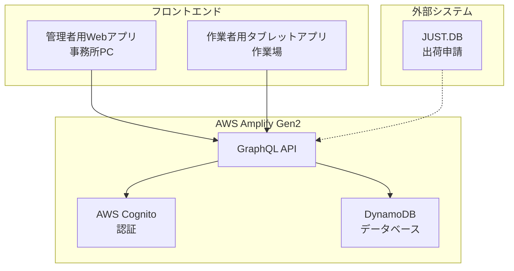
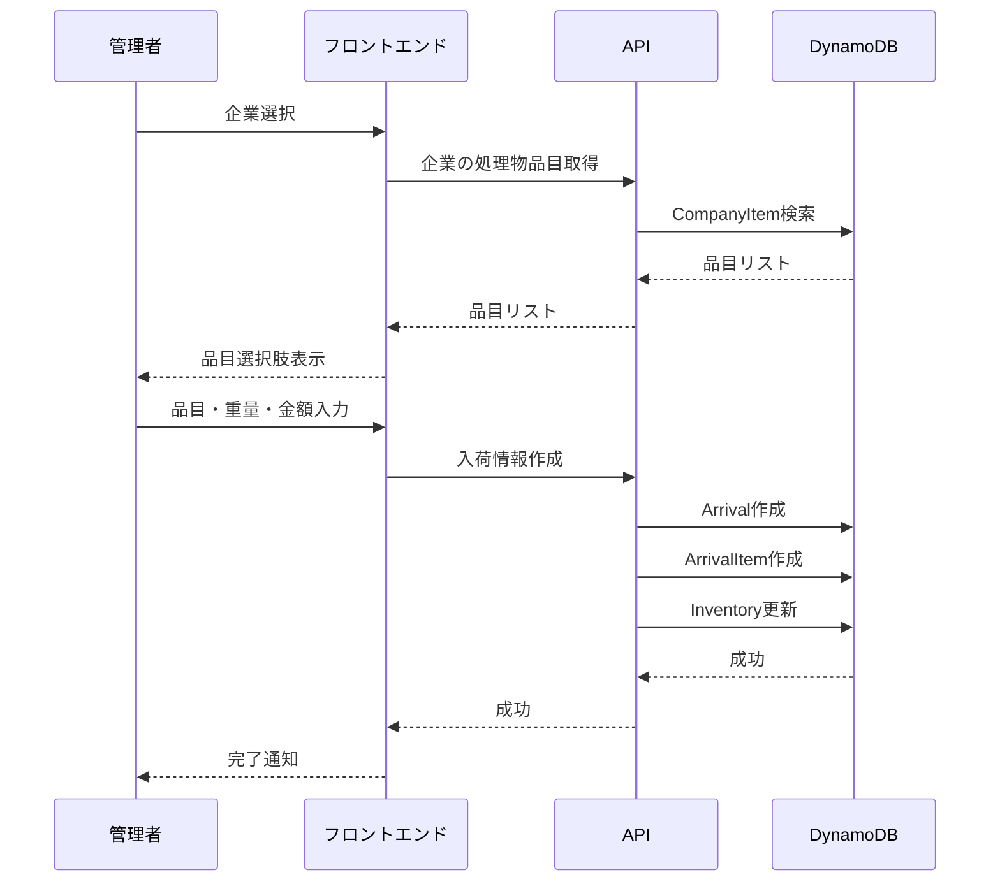
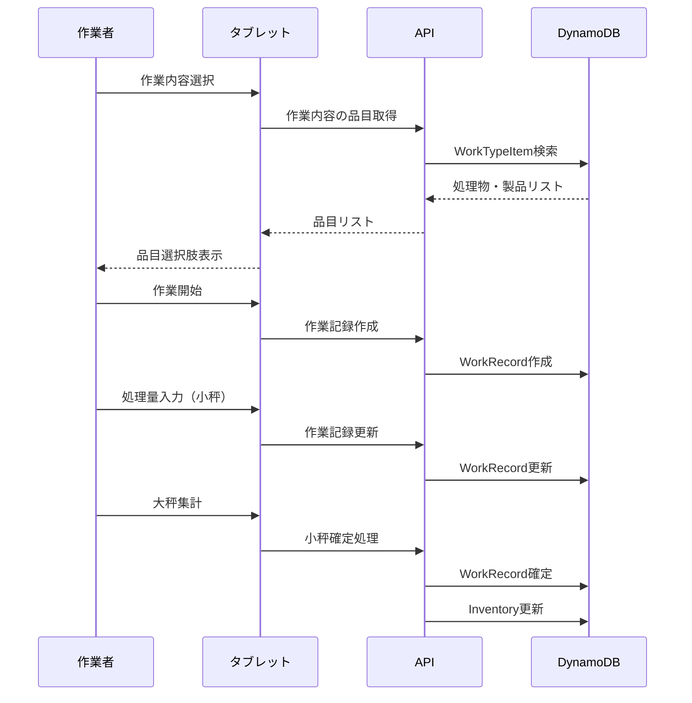

# 半田港手解体室アプリ アプリケーション設計書

## 概要

半田港手解体室における廃棄物処理・リサイクル業務を効率化するためのWebアプリケーション設計です。

## システムアーキテクチャ



## アプリケーション構成

### 1. 管理者用Webアプリ (admin-web)
**対象ユーザー**: 事務所スタッフ  
**デバイス**: PC（キーボード・マウス操作）

#### 主要機能
- **入荷情報管理**
  - 企業選択 → 処理物品目絞り込み
  - 重量・金額入力
  - 在庫自動更新

- **出荷情報管理**
  - 出荷先選択 → 製品品目絞り込み
  - ロットNo.自動生成
  - 単価・数量入力

- **マスタ管理**
  - 企業マスタ
  - 品目マスタ
  - 作業者マスタ
  - 作業内容マスタ
  - 出荷先マスタ
  - トラブル情報マスタ

- **在庫管理**
  - 品目別在庫一覧
  - 在庫推移グラフ
  - 在庫アラート

- **レポート・分析**
  - 作業実績レポート
  - 入荷・出荷実績
  - CSV出力機能

### 2. 作業者用タブレットアプリ (worker-tablet)
**対象ユーザー**: 作業者  
**デバイス**: タブレット（タッチ操作）

#### 主要機能
- **作業記録**
  - 作業者選択
  - 作業内容選択 → 処理物・製品絞り込み
  - 午前・午後選択
  - 作業開始・終了時刻記録

- **処理量入力**
  - 小秤入力（薄い青背景）
  - 大秤入力（薄い緑背景）
  - CRT個数管理対応

- **在庫確認**
  - 処理物在庫一覧
  - 製品在庫一覧
  - リアルタイム更新

- **トラブル報告**
  - トラブル種別選択
  - 備考入力

## 画面設計

### 管理者用Webアプリ

#### 1. ダッシュボード
```
┌─────────────────────────────────────────┐
│ 半田港手解体室管理システム              │
├─────────────────────────────────────────┤
│ 今日の実績                              │
│ ┌─────────┐ ┌─────────┐ ┌─────────┐   │
│ │入荷: 5件 │ │作業: 12件│ │出荷: 3件 │   │
│ └─────────┘ └─────────┘ └─────────┘   │
│                                         │
│ 在庫アラート                            │
│ ⚠️ 鉄スクラップ: 在庫少 (50kg)          │
│                                         │
│ 最近の作業記録                          │
│ ┌─────────────────────────────────────┐ │
│ │時刻    │作業者  │作業内容│処理量    │ │
│ │10:30   │田中    │解体    │120kg     │ │
│ │10:15   │佐藤    │分別    │80kg      │ │
│ └─────────────────────────────────────┘ │
└─────────────────────────────────────────┘
```

#### 2. 入荷情報登録
```
┌─────────────────────────────────────────┐
│ 入荷情報登録                            │
├─────────────────────────────────────────┤
│ 入荷日: [2025/06/08] [今日]             │
│                                         │
│ 企業名: [▼ 選択してください]            │
│                                         │
│ 処理物品目                              │
│ ┌─────────────────────────────────────┐ │
│ │品目名     │重量(kg)│金額(円)│[削除]│ │
│ │鉄スクラップ│[     ]│[     ]│ [×] │ │
│ │[+ 品目追加]                         │ │
│ └─────────────────────────────────────┘ │
│                                         │
│ 合計金額: ¥0                            │
│                                         │
│ [キャンセル] [保存]                     │
└─────────────────────────────────────────┘
```

#### 3. マスタ管理
```
┌─────────────────────────────────────────┐
│ マスタ管理                              │
├─────────────────────────────────────────┤
│ [企業] [品目] [作業者] [作業内容] [出荷先]│
│                                         │
│ 企業マスタ                              │
│ ┌─────────────────────────────────────┐ │
│ │検索: [        ] [🔍]                │ │
│ │                                     │ │
│ │企業名              │作成日  │[操作]│ │
│ │トヨタ自動車        │06/01   │[編集]│ │
│ │ホンダ              │06/01   │[編集]│ │
│ │日産自動車          │06/02   │[編集]│ │
│ │                                     │ │
│ │[+ 新規追加]                         │ │
│ └─────────────────────────────────────┘ │
└─────────────────────────────────────────┘
```

### 作業者用タブレットアプリ

#### 1. 作業選択画面
```
┌─────────────────────────────────────────┐
│ 作業記録                                │
├─────────────────────────────────────────┤
│                                         │
│ 作業者: [▼ 田中太郎]                    │
│                                         │
│ 作業時間帯                              │
│ ○ 午前 (8:00-12:00)                     │
│ ○ 午後 (13:00-17:00)                    │
│                                         │
│ 作業内容: [▼ 選択してください]          │
│                                         │
│ ┌─────────────────────────────────────┐ │
│ │             作業開始                │ │
│ │                                     │ │
│ │         [▶️ 開始する]                │ │
│ └─────────────────────────────────────┘ │
│                                         │
│ [在庫確認] [作業履歴]                   │
└─────────────────────────────────────────┘
```

#### 2. 処理量入力画面
```
┌─────────────────────────────────────────┐
│ 処理量入力                              │
├─────────────────────────────────────────┤
│ 作業者: 田中太郎                        │
│ 作業内容: 鉄スクラップ解体              │
│ 開始時刻: 10:30                         │
│                                         │
│ 処理物: [▼ 鉄スクラップ]                │
│                                         │
│ 処理量入力                              │
│ ┌─────────────────────────────────────┐ │
│ │ 小秤入力 (薄い青背景)               │ │
│ │ [     ] kg                          │ │
│ └─────────────────────────────────────┘ │
│ ┌─────────────────────────────────────┐ │
│ │ 大秤入力 (薄い緑背景)               │ │
│ │ [     ] kg                          │ │
│ └─────────────────────────────────────┘ │
│                                         │
│ トラブル: [▼ なし]                      │
│                                         │
│ [作業終了] [一時保存]                   │
└─────────────────────────────────────────┘
```

#### 3. 在庫確認画面
```
┌─────────────────────────────────────────┐
│ 在庫確認                                │
├─────────────────────────────────────────┤
│ [処理物] [製品]                         │
│                                         │
│ 処理物在庫                              │
│ ┌─────────────────────────────────────┐ │
│ │品目名        │在庫量    │単位      │ │
│ │鉄スクラップ  │1,250     │kg        │ │
│ │アルミ缶      │340       │kg        │ │
│ │CRT          │25        │個        │ │
│ │銅線         │180       │kg        │ │
│ └─────────────────────────────────────┘ │
│                                         │
│ 最終更新: 2025/06/08 10:25              │
│                                         │
│ [🔄 更新] [戻る]                        │
└─────────────────────────────────────────┘
```

## 技術仕様

### フロントエンド
- **フレームワーク**: Next.js 14 (App Router)
- **言語**: TypeScript
- **スタイリング**: Tailwind CSS
- **状態管理**: Zustand
- **フォーム**: React Hook Form + Zod
- **UI コンポーネント**: Radix UI + shadcn/ui

### バックエンド
- **API**: AWS Amplify Gen2 GraphQL
- **認証**: AWS Cognito
- **データベース**: DynamoDB
- **ファイルストレージ**: S3 (CSV出力用)

### 開発・デプロイ
- **モノレポ**: Turborepo
- **パッケージマネージャー**: npm
- **CI/CD**: AWS Amplify Hosting
- **型安全性**: GraphQL Code Generator

## データフロー

### 1. 入荷処理フロー


### 2. 作業記録フロー


## セキュリティ設計

### 認証・認可
```typescript
// Cognito ユーザーグループ
enum UserGroup {
  ADMIN = 'admin',     // 管理者（全機能）
  WORKER = 'worker'    // 作業者（作業記録・在庫確認のみ）
}

// GraphQL 認可ルール例
type WorkRecord @auth(rules: [
  { allow: groups, groups: ["admin"] },
  { allow: groups, groups: ["worker"], operations: [create, read] }
]) {
  // ...
}
```

### データ保護
- API通信: HTTPS強制
- 機密データ: DynamoDB暗号化
- 監査ログ: CloudTrail
- アクセス制御: IAM Role

## パフォーマンス最適化

### フロントエンド
- **コード分割**: Next.js dynamic import
- **画像最適化**: Next.js Image component
- **キャッシュ**: SWR / React Query
- **バンドル最適化**: Webpack Bundle Analyzer

### バックエンド
- **GraphQL最適化**: DataLoader パターン
- **DynamoDB最適化**: 適切なインデックス設計
- **キャッシュ**: CloudFront CDN
- **レスポンス圧縮**: gzip/brotli

## 運用・監視

### ログ・監視
- **アプリケーションログ**: CloudWatch Logs
- **メトリクス**: CloudWatch Metrics
- **エラー追跡**: AWS X-Ray
- **アラート**: CloudWatch Alarms

### バックアップ・復旧
- **DynamoDB**: Point-in-time Recovery
- **コード**: Git リポジトリ
- **設定**: Infrastructure as Code (CDK)

## 今後の拡張予定

### Phase 2
- **モバイルアプリ**: React Native
- **リアルタイム通知**: WebSocket
- **高度な分析**: QuickSight ダッシュボード

### Phase 3
- **IoT連携**: 秤の自動データ取得
- **AI活用**: 品目自動判別
- **多工場対応**: マルチテナント化
