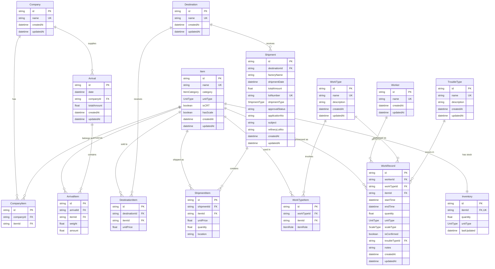
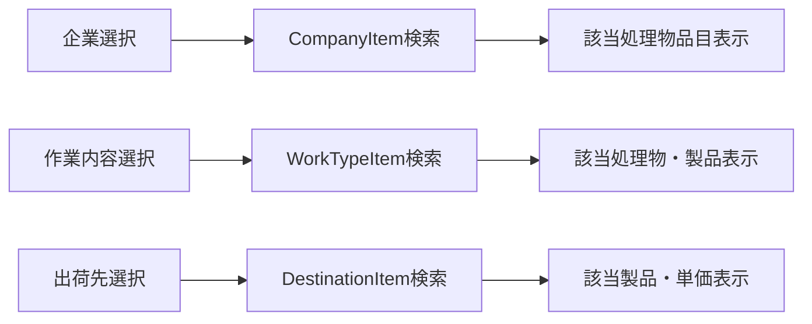
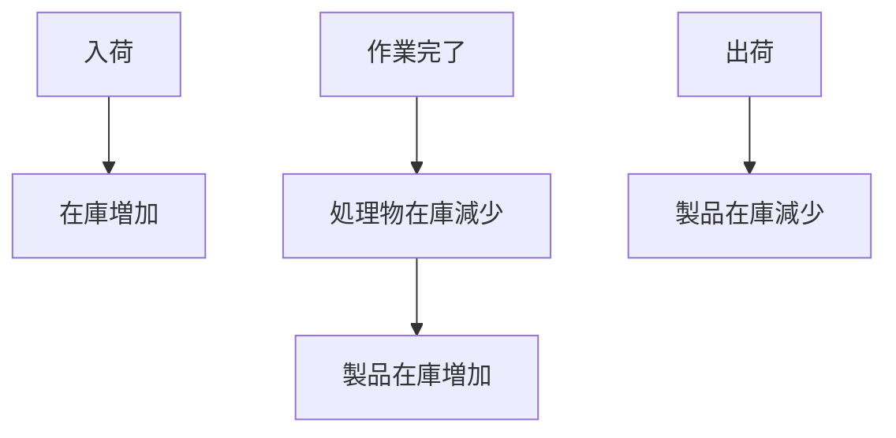
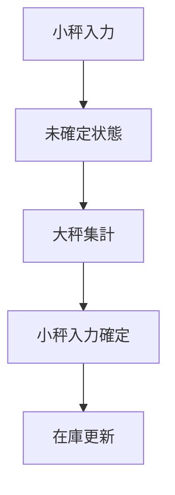

# 半田港手解体室アプリ データベースER図

## 概要

半田港手解体室アプリのデータベース設計をER図で視覚化したものです。

## ER図

## エンティティ詳細

### マスタエンティティ

#### Company（企業マスタ）
- **目的**: 処理物を持ち込む企業の管理
- **主要属性**: 企業名
- **関連**: 入荷情報、企業-品目紐づけ

#### Item（品目マスタ）
- **目的**: 処理物・製品の品目管理
- **主要属性**: 品目名、カテゴリ（処理物/製品）、単位種別（重量/個数）、CRT判定
- **関連**: 全ての業務プロセスで使用

#### Worker（作業者マスタ）
- **目的**: 作業者の管理
- **主要属性**: 作業者名
- **関連**: 作業記録

#### WorkType（作業内容マスタ）
- **目的**: 解体・分別作業の種類管理
- **主要属性**: 作業内容名、説明
- **関連**: 作業記録、作業内容-品目紐づけ

#### Destination（出荷先マスタ）
- **目的**: 製品の出荷先管理
- **主要属性**: 出荷先名
- **関連**: 出荷情報、出荷先-製品紐づけ

#### TroubleType（トラブル情報マスタ）
- **目的**: 作業中のトラブル種類管理
- **主要属性**: トラブル名、説明
- **関連**: 作業記録

### 中間エンティティ

#### CompanyItem（企業-品目紐づけ）
- **目的**: 企業が持ち込む処理物品目の関連管理
- **ビジネスルール**: 企業選択時に該当する処理物品目を絞り込み

#### WorkTypeItem（作業内容-品目紐づけ）
- **目的**: 作業内容と処理物・製品の関連管理
- **ビジネスルール**: 作業内容選択時に該当する処理物・製品を絞り込み

#### DestinationItem（出荷先-製品紐づけ）
- **目的**: 出荷先と製品の関連・単価管理
- **ビジネスルール**: 出荷先選択時に該当する製品と単価を絞り込み

### トランザクションエンティティ

#### Arrival / ArrivalItem（入荷情報）
- **目的**: 処理物の入荷記録
- **ビジネスルール**: 入荷時に在庫を増加

#### WorkRecord（作業記録）
- **目的**: 作業者の作業実績記録
- **ビジネスルール**: 
  - 大坪・小坪管理（対象品目のみ）
  - 大坪集計時に小坪入力を確定
  - CRT品目は個数管理も可能

#### Shipment / ShipmentItem（出荷情報）
- **目的**: 製品の出荷記録
- **ビジネスルール**: 
  - ロットNo.自動生成（YYYYMMDDXXN）
  - 出荷時に在庫を減少

#### Inventory（在庫管理）
- **目的**: 品目別在庫情報
- **ビジネスルール**: 入荷・作業・出荷により自動更新

## 主要なビジネスルール

### 1. マスタ選択による絞り込み

### 2. 在庫更新フロー

### 3. 小秤・大秤管理

## データ整合性制約

### 主キー制約
- 全テーブルで`id`フィールドが主キー
- `lotNumber`（ロットNo.）はユニーク制約

### 外部キー制約
- 全ての関連テーブル間で外部キー制約を設定
- カスケード削除は中間テーブルのみ適用

### ビジネス制約
- 企業名、品目名、作業者名等はユニーク制約
- CRT品目のみ個数管理可能
- 大秤入力時は対応する小秤入力が存在する必要がある

## インデックス設計

### パフォーマンス重視のインデックス
- `work_records.start_time`: 作業記録の日付検索
- `arrivals.date`: 入荷情報の日付検索
- `shipments.shipment_date`: 出荷情報の日付検索
- `shipments.lot_number`: ロットNo.検索（ユニーク）

### 検索頻度の高いフィールド
- 各マスタテーブルの`name`フィールド
- 各中間テーブルの外部キーフィールド
